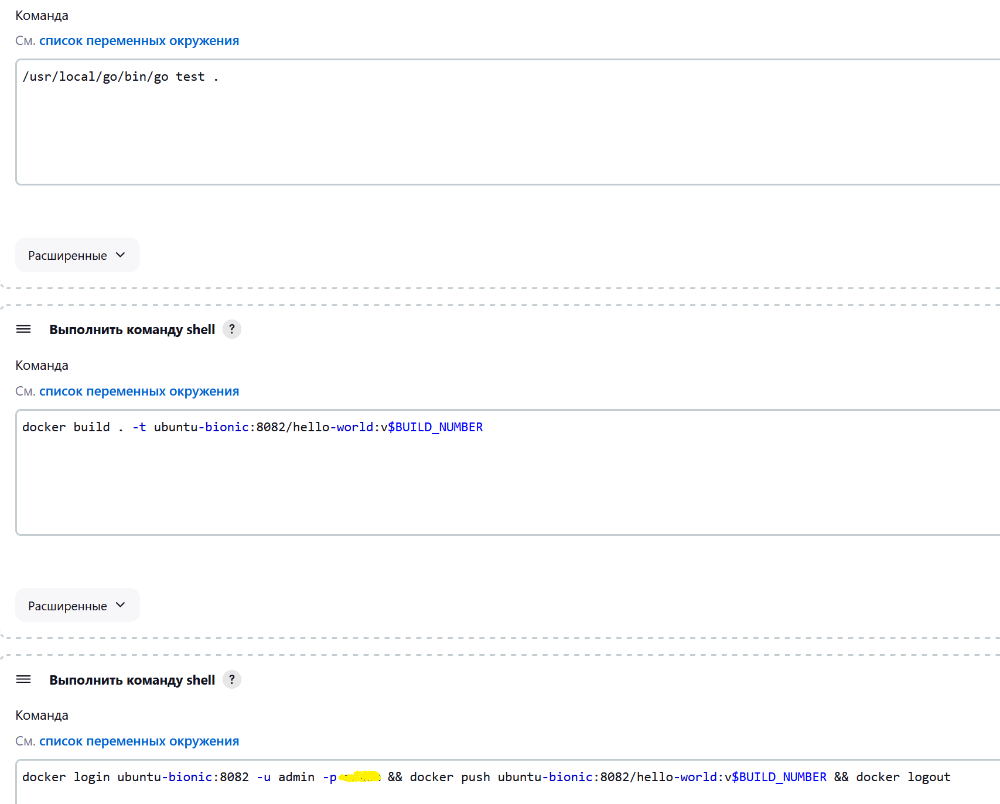
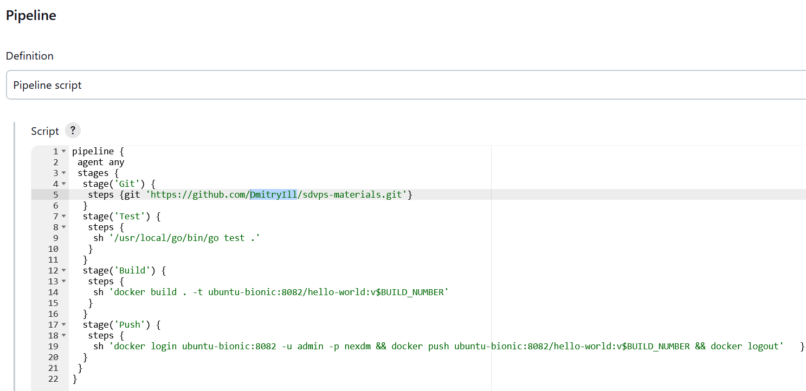

# Домашнее задание к занятию "`CI-CD Jenkins`" - `Илларионов Дмитрий`

---

### Задание 1

**Что нужно сделать:**

1. Установите себе jenkins по инструкции из лекции или любым другим способом из официальной документации. Использовать Docker в этом задании нежелательно.
2. Установите на машину с jenkins [golang](https://golang.org/doc/install).
3. Используя свой аккаунт на GitHub, сделайте себе форк [репозитория](https://github.com/netology-code/sdvps-materials.git). В этом же репозитории находится [дополнительный материал для выполнения ДЗ](https://github.com/netology-code/sdvps-materials/blob/main/CICD/8.2-hw.md).
3. Создайте в jenkins Freestyle Project, подключите получившийся репозиторий к нему и произведите запуск тестов и сборку проекта ```go test .``` и  ```docker build .```.

В качестве ответа пришлите скриншоты с настройками проекта и результатами выполнения сборки.

Создал две ВМ на yandex-облаке:


на ВМ 1 jenkins:


Установил go lang:


Сделал копию репозитория у себя:


Создал проект в jenkins и настроил Nexus:


Вот результат вывода в консоли:


```
Started by user DmIl
Running as SYSTEM
Building in workspace /var/lib/jenkins/workspace/pip1
The recommended git tool is: NONE
No credentials specified
 > git rev-parse --resolve-git-dir /var/lib/jenkins/workspace/pip1/.git # timeout=10
Fetching changes from the remote Git repository
 > git config remote.origin.url https://github.com/DmitryIll/sdvps-materials.git # timeout=10
Fetching upstream changes from https://github.com/DmitryIll/sdvps-materials.git
 > git --version # timeout=10
 > git --version # 'git version 2.17.1'
 > git fetch --tags --progress -- https://github.com/DmitryIll/sdvps-materials.git +refs/heads/*:refs/remotes/origin/* # timeout=10
 > git rev-parse refs/remotes/origin/master^{commit} # timeout=10
Checking out Revision da5acf7bcb7f437637adf06fbd03a24dc2c8f13e (refs/remotes/origin/master)
 > git config core.sparsecheckout # timeout=10
 > git checkout -f da5acf7bcb7f437637adf06fbd03a24dc2c8f13e # timeout=10
Commit message: "branch main, add creds for vagrant box"
 > git rev-list --no-walk da5acf7bcb7f437637adf06fbd03a24dc2c8f13e # timeout=10
[pip1] $ /bin/sh -xe /tmp/jenkins10865810809485228242.sh
+ /usr/local/go/bin/go test .
ok  	github.com/netology-code/sdvps-materials	(cached)
[pip1] $ /bin/sh -xe /tmp/jenkins4071783132329438628.sh
+ docker build . -t ubuntu-bionic:8082/hello-world:v14
#1 [internal] load .dockerignore
#1 transferring context: 2B done
#1 DONE 0.1s

#2 [internal] load build definition from Dockerfile
#2 transferring dockerfile: 350B done
#2 DONE 0.1s

#3 [internal] load metadata for docker.io/library/golang:1.16
#3 ...

#4 [internal] load metadata for docker.io/library/alpine:latest
#4 DONE 0.7s

#3 [internal] load metadata for docker.io/library/golang:1.16
#3 DONE 0.7s

#5 [builder 1/4] FROM docker.io/library/golang:1.16@sha256:5f6a4662de3efc6d6bb812d02e9de3d8698eea16b8eb7281f03e6f3e8383018e
#5 DONE 0.0s

#6 [stage-1 1/3] FROM docker.io/library/alpine:latest@sha256:7144f7bab3d4c2648d7e59409f15ec52a18006a128c733fcff20d3a4a54ba44a
#6 DONE 0.0s

#7 [internal] load build context
#7 transferring context: 13.11kB 0.0s done
#7 DONE 0.1s

#8 [builder 2/4] WORKDIR /go/src/github.com/netology-code/sdvps-materials
#8 CACHED

#9 [builder 3/4] COPY . ./
#9 CACHED

#10 [builder 4/4] RUN CGO_ENABLED=0 GOOS=linux go build -a -installsuffix nocgo -o /app .
#10 CACHED

#11 [stage-1 2/3] RUN apk -U add ca-certificates
#11 CACHED

#12 [stage-1 3/3] COPY --from=builder /app /app
#12 CACHED

#13 exporting to image
#13 exporting layers done
#13 writing image sha256:c902deb3ec96e029ca1ecc53fc1d5c8fb54dff051f4ba136eb57c60e2007ef42 done
#13 naming to ubuntu-bionic:8082/hello-world:v14 0.0s done
#13 DONE 0.0s
[pip1] $ /bin/sh -xe /tmp/jenkins2516433137622223135.sh
+ docker login ubuntu-bionic:8082 -u admin -p ***
WARNING! Using --password via the CLI is insecure. Use --password-stdin.
WARNING! Your password will be stored unencrypted in /var/lib/jenkins/.docker/config.json.
Configure a credential helper to remove this warning. See
https://docs.docker.com/engine/reference/commandline/login/#credentials-store

Login Succeeded
+ docker push ubuntu-bionic:8082/hello-world:v14
The push refers to repository [ubuntu-bionic:8082/hello-world]
42c827470373: Preparing
925d88ae272d: Preparing
4693057ce236: Preparing
42c827470373: Pushed
925d88ae272d: Pushed
4693057ce236: Pushed
v14: digest: sha256:0d46b6f78fb685a975340cacc9dacd67a66b4aaf75ac9442f8df061c68b21608 size: 950
+ docker logout
Removing login credentials for https://index.docker.io/v1/
Finished: SUCCESS
```


---
команды в пайплайне:

---



---

Текстом команды:

```
/usr/local/go/bin/go test .
```

```
docker build . -t ubuntu-bionic:8082/hello-world:v$BUILD_NUMBER
```

```
docker login ubuntu-bionic:8082 -u admin -p *** && docker push ubuntu-bionic:8082/hello-world:v$BUILD_NUMBER && docker logout
```

---

Nexus:

---


---


### Задание 2

**Что нужно сделать:**

1. Создайте новый проект pipeline.
2. Перепишите сборку из задания 1 на declarative в виде кода.

В качестве ответа пришлите скриншоты с настройками проекта и результатами выполнения сборки.

***Результаты***
Создал Pip3.


Настройки:


Код:




Или в IDE:


Код текстом:

```
pipeline {
 agent any
 stages {
  stage('Git') {
   steps {git 'https://github.com/DmitryIll/sdvps-materials.git'}
  }
  stage('Test') {
   steps {
    sh '/usr/local/go/bin/go test .'
   }
  }
  stage('Build') {
   steps {
    sh 'docker build . -t ubuntu-bionic:8082/hello-world:v$BUILD_NUMBER'
   }
  }
  stage('Push') {
   steps {
    sh 'docker login ubuntu-bionic:8082 -u admin -p nexdm && docker push ubuntu-bionic:8082/hello-world:v$BUILD_NUMBER && docker logout'   }
  }
 }
}
```

Выполнил успешно сборку:


```
Started by user Dmitry Ill
[Pipeline] Start of Pipeline
[Pipeline] node
Running on Jenkins in /var/lib/jenkins/workspace/pip3
[Pipeline] {
[Pipeline] stage
[Pipeline] { (Git)
[Pipeline] git
The recommended git tool is: NONE
No credentials specified
 > git rev-parse --resolve-git-dir /var/lib/jenkins/workspace/pip3/.git # timeout=10
Fetching changes from the remote Git repository
 > git config remote.origin.url https://github.com/DmitryIll/sdvps-materials.git # timeout=10
Fetching upstream changes from https://github.com/DmitryIll/sdvps-materials.git
 > git --version # timeout=10
 > git --version # 'git version 2.17.1'
 > git fetch --tags --progress -- https://github.com/DmitryIll/sdvps-materials.git +refs/heads/*:refs/remotes/origin/* # timeout=10
 > git rev-parse refs/remotes/origin/master^{commit} # timeout=10
Checking out Revision f98d90910d4f88f30a71f69e173ee52c2f998c10 (refs/remotes/origin/master)
 > git config core.sparsecheckout # timeout=10
 > git checkout -f f98d90910d4f88f30a71f69e173ee52c2f998c10 # timeout=10
 > git branch -a -v --no-abbrev # timeout=10
 > git branch -D master # timeout=10
 > git checkout -b master f98d90910d4f88f30a71f69e173ee52c2f998c10 # timeout=10
Commit message: "Update main.go"
 > git rev-list --no-walk f98d90910d4f88f30a71f69e173ee52c2f998c10 # timeout=10
[Pipeline] }
[Pipeline] // stage
[Pipeline] stage
[Pipeline] { (Test)
[Pipeline] sh
+ /usr/local/go/bin/go test .
ok  	github.com/netology-code/sdvps-materials	(cached)
[Pipeline] }
[Pipeline] // stage
[Pipeline] stage
[Pipeline] { (Build)
[Pipeline] sh
+ docker build . -t ubuntu-bionic:8082/hello-world:v6
#1 [internal] load build definition from Dockerfile
#1 transferring dockerfile:
#1 transferring dockerfile: 350B done
#1 DONE 0.1s

#2 [internal] load .dockerignore
#2 transferring context: 2B done
#2 DONE 0.3s

#3 [internal] load metadata for docker.io/library/golang:1.16
#3 DONE 1.3s

#4 [internal] load metadata for docker.io/library/alpine:latest
#4 DONE 1.5s

#5 [builder 1/4] FROM docker.io/library/golang:1.16@sha256:5f6a4662de3efc6d6bb812d02e9de3d8698eea16b8eb7281f03e6f3e8383018e
#5 DONE 0.0s

#6 [stage-1 1/3] FROM docker.io/library/alpine:latest@sha256:eece025e432126ce23f223450a0326fbebde39cdf496a85d8c016293fc851978
#6 DONE 0.0s

#7 [internal] load build context
#7 transferring context: 5.30kB 0.0s done
#7 DONE 0.2s

#8 [builder 2/4] WORKDIR /go/src/github.com/netology-code/sdvps-materials
#8 CACHED

#9 [builder 3/4] COPY . ./
#9 DONE 1.3s

#10 [builder 4/4] RUN CGO_ENABLED=0 GOOS=linux go build -a -installsuffix nocgo -o /app .
#10 DONE 44.1s

#11 [stage-1 2/3] RUN apk -U add ca-certificates
#11 CACHED

#12 [stage-1 3/3] COPY --from=builder /app /app
#12 CACHED

#13 exporting to image
#13 exporting layers done
#13 writing image sha256:1f15abc80907583eb671382fe62bc9070cf2fcca5ac421196d58ff87d6cbbb99 0.0s done
#13 naming to ubuntu-bionic:8082/hello-world:v6 0.1s done
#13 DONE 0.1s
[Pipeline] }
[Pipeline] // stage
[Pipeline] stage
[Pipeline] { (Push)
[Pipeline] sh
+ docker login ubuntu-bionic:8082 -u admin -p nexdm
WARNING! Using --password via the CLI is insecure. Use --password-stdin.
WARNING! Your password will be stored unencrypted in /var/lib/jenkins/.docker/config.json.
Configure a credential helper to remove this warning. See
https://docs.docker.com/engine/reference/commandline/login/#credentials-store

Login Succeeded
+ docker push ubuntu-bionic:8082/hello-world:v6
The push refers to repository [ubuntu-bionic:8082/hello-world]
2f285f277eac: Preparing
5fa9bb9d3992: Preparing
cc2447e1835a: Preparing
2f285f277eac: Pushed
cc2447e1835a: Pushed
5fa9bb9d3992: Pushed
v6: digest: sha256:810bf719856ed7c3213ae19311160b0196ba2398a988aa10335dbe50d31b884b size: 950
+ docker logout
Removing login credentials for https://index.docker.io/v1/
[Pipeline] }
[Pipeline] // stage
[Pipeline] }
[Pipeline] // node
[Pipeline] End of Pipeline
Finished: SUCCESS
```


---

### Задание 3

**Что нужно сделать:**

1. Установите на машину Nexus.
1. Создайте raw-hosted репозиторий.
1. Измените pipeline так, чтобы вместо Docker-образа собирался бинарный go-файл. Команду можно скопировать из Dockerfile.
1. Загрузите файл в репозиторий с помощью jenkins.

В качестве ответа пришлите скриншоты с настройками проекта и результатами выполнения сборки.

---
## Дополнительные задания* (со звёздочкой)

Их выполнение необязательное и не влияет на получение зачёта по домашнему заданию. Можете их решить, если хотите лучше разобраться в материале.

---

### Задание 4*

Придумайте способ версионировать приложение, чтобы каждый следующий запуск сборки присваивал имени файла новую версию. Таким образом, в репозитории Nexus будет храниться история релизов.

Подсказка: используйте переменную BUILD_NUMBER.

В качестве ответа пришлите скриншоты с настройками проекта и результатами выполнения сборки.


---
Черновик:

```
pipeline {
agent any
stages {
stage('Git') {
steps {git 'https://github.com/killmeplz/k8s-job-sidekiller.git'}
}
stage('Build') {
steps {
sh 'docker build .'
sh 'helm package .helm'
sh 'curl -u admin:123
http://10.168.10.220:8081/repository/helm-test/ --upload-file
k8s-job-sidekiller-0.1.0.tgz -v'
}
}
}
}
```


---

### Инструкция по выполнению домашнего задания
      - в каждом задании добавьте решение в требуемом виде (текст/код/скриншоты/ссылка)
      - для корректного добавления скриншотов воспользуйтесь [инструкцией "Как вставить скриншот в шаблон с решением](https://github.com/netology-code/sys-pattern-homework/blob/main/screen-instruction.md)
      - при оформлении используйте возможности языка разметки md (коротко об этом можно посмотреть в [инструкции  по MarkDown](https://github.com/netology-code/sys-pattern-homework/blob/main/md-instruction.md))
   
### Дополнительные материалы, которые могут быть полезны для выполнения задания

1. [Руководство по оформлению Markdown файлов](https://gist.github.com/Jekins/2bf2d0638163f1294637#Code)

---

### Задание 1

`Приведите ответ в свободной форме........`

1. `Заполните здесь этапы выполнения, если требуется ....`
2. `Заполните здесь этапы выполнения, если требуется ....`
3. `Заполните здесь этапы выполнения, если требуется ....`
4. `Заполните здесь этапы выполнения, если требуется ....`
5. `Заполните здесь этапы выполнения, если требуется ....`
6. 

```
Поле для вставки кода...
....
....
....
....
```

`При необходимости прикрепитe сюда скриншоты
`


---

